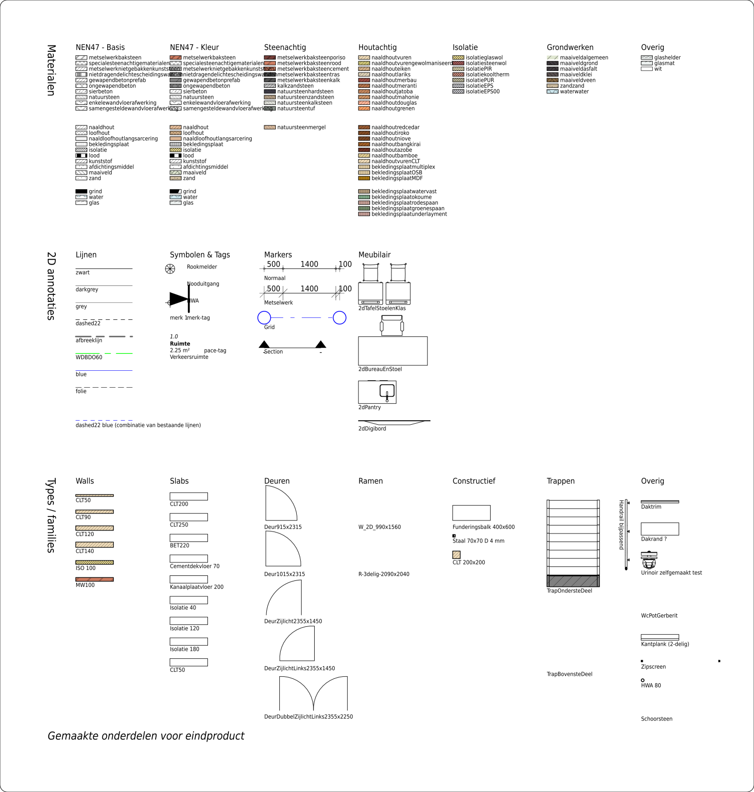

# INB-Template (Ifc NL Bouw)
INB staat voor **I**fc **N**l **B**ouw
Deze repository bevat een experimentele IFC-template en beknopte bibliotheek voor de bouwsector in Nederland. 

# Aanleiding
De aanleiding tot het maken van deze templateis zijn de onstuimige ontwikkelingen binnen https://blenderbim.org/. BlenderBIM een Open Source BIM-modelling tool voor de AEC. De verwachting is dat BlenderBIM < medio 2025 geschikt zal zijn om als BIM modelling pakket te kunnen gebruiken.

# Versie
De gebruikte versie is IFC4x3.

# Doel
Het doel van deze repository is om tot een eerste versie te komen van een Nederlandse IFC template die onder andere te gebruiken is binnen BlenderBIM en FreeCAD. 
De template en bibliotheek moet zowel geschikt zijn voor bouwkunde als constructie.
Het idee is dat je een standaard kunt ontwikkelen via Github zonder gebruikersgroepen en commissies. Om mee te kunnen doen moet je met Github kunnen werken en in staat zijn om goede voorstellen te doen. 

# Stand van zaken
De onderstaande zaken zijn in de eerste versie geimplementeerd:
* Arceringen 
  * Arceringen conform NEN47
  * Arceringen inclusief achtergrondkleur
  * Achtergrondkleur met als toevoeging het daadwerkelijke materiaal
  * CSS-bestanden met arceringen per schaal.
* Wandtypes
* Vloertypes
* Daktypes
* Staalprofielen: HEA, HEB, HEM, IPE, AA, HD, DIN, DIE, DIL, DIR, Koker, Buis, T, L
* Beton, hout, staal, generiek rechthoekige en ronde profielen
* Basis materialen
* Basis 

Nog uit te voeren
* Classificaties(NL-SFB, STABU)
* Property Sets
* Palen en palenplan
* Wapening
* Staalverbindingen
* Kozijnen
  
# Ontwerpfilosofie en uitgangspunten
* Principe is om de template en alle arceerbestanden(CSS, PAT) te genereren via Python met behulp van IfcOpenShell. Er zijn 2 Pythonbestanden:
  * scripts/CreatePatternCSSFiles.py: Maakt alle CSS-bestanden voor elke schaal alsmede het pattern-bestand. De basis is het ODS-bestand in de hoofdmap
  * scripts/CreateLibrary.py: Maakt de bibliotheek en het template-bestand op basis van het ODS-bestand in de hoofdmap.
* Het idee is om deze op termijn om te zetten naar een 

# Naamgevingsconventies
Voor deze nieuwe Nederlandse Ifc-template hanteren we eenvoudige naamgevingsregels, zonder de complexiteit van de Nederlandse Revit Standaarden (NLRS).

## Principes
  - Engelse Terminologie:
  Waar mogelijk, gebruiken we ongewijzigde Engelse termen voor consistentie en herkenbaarheid. 

  - Nederlandse Terminologie voor Materialen:
  Materialen en Nederland-specifieke elementen benoemen we in het Nederlands.
  
  - Uitwisselbare Naamgeving:
  We streven naar termen die makkelijk herkenbaar en interpreteerbaar zijn voor verschillende gebruikers.

  - Volgens NAA.K.T:
  Qua materialen volgen we de richtlijnen van de NAAm_Kenmerk_Toepassing (NAA.K.T.) methode.

# To Do lijst
* Lijndiktes in arceringen mee laten verschalen.
* 

